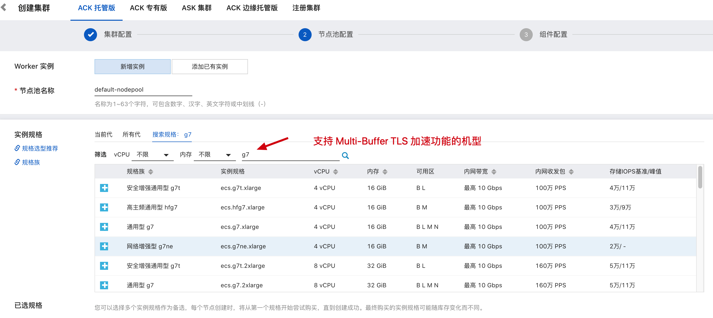
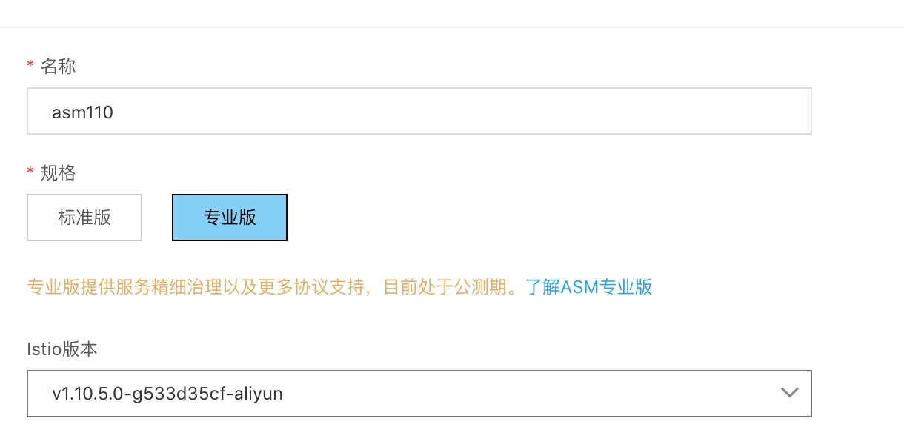
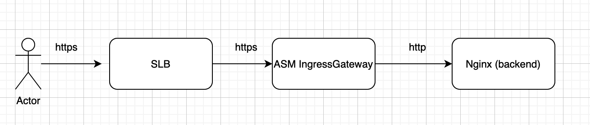

## 前提

- 创建一个ACK 集群 （https://cs.console.aliyun.com) ,其中配置 Worker 节点时需要选择 g7 规格类型的节点

  

- 创建一个ASM 实例 (https://servicemesh.console.aliyun.com/), 版本选择1.10+ 专业版

  

- ASM 实例添加第一步创建的ACK 集群

- ECS 一台用户作为压测机器: perf-client (同一个VPC)

  

## Install Demo 

Git clone 本项目到ECS 压测机器 perf-client

以Root 用户进行操作：

首先配置user_kube_config.conf 和 asm_kube_config.conf 分别指向用户K8s 集群的kubeconfig 和ASM 实例的kubeconfig

然后执行：make install 

安装Nginx backend 服务以及ASM 网关以及相关配置；

具体可参考ASM 官方文档：https://help.aliyun.com/document_detail/164654.html

## 性能效果验证

压测工具我们采用k6 ,需要在压测机器上进行安装，参考： https://k6.io/docs/getting-started/installation/

- 开启multibuffer 功能后，执行

 make perf_enable

- 关闭multibuffer 功能后，执行

 make perf_disable
