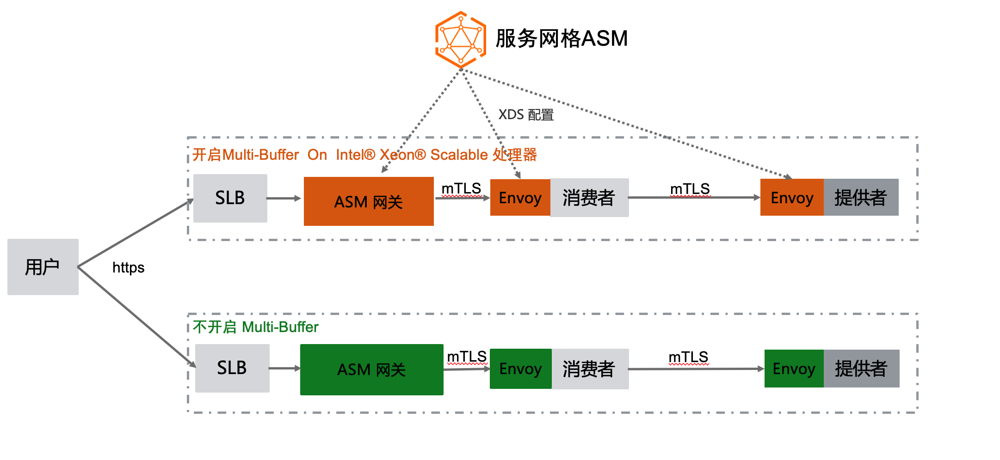
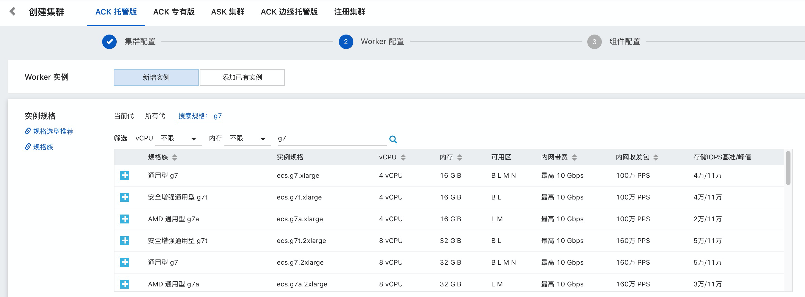

# ASM Pro 支持Multi-Buffer 实现tls 加速

## 背景

在 Istio 中，Envoy 可以承担两种角色：

1. 作为 Ingress Gateway，这种情况下，Envoy 独立承担 Gateway 的角色，它主要负责接受客户端的请求，同时动态地从控制面通过 xds 获取配置信息，再根据这些配置将请求转发给集群内部的各个微服务。
2. 作为集群内部微服务的代理，Envoy 会以 sidecar 的形式存在，它会劫持当前微服务的所有进出口流量，然后根据控制面下发的各种规则进行动态配置，根据这些配置对请求进行决策和转发。

接着我们来回顾一下 TLS。目前，随着网络安全技术的发展， TLS 已经成为网络通信的基石。一个 TLS 会话的处理过程总体上可分为握手阶段和数据传输阶段，握手阶段最重要的任务是使用非对称加密技术协商出一个会话密钥，然后在数据传输阶段，使用协商出的会话密钥对数据执行对称加密操作，再进行传输。

在微服务场景下，Envoy 无论是作为 Ingress Gateway 还是作为微服务的代理，都需要处理大量的 TLS 请求，尤其在握手阶段执行非对称加解密的操作时，需要消耗大量的 CPU 资源，在大规模微服务场景下这可能会成为一个瓶颈。 ASM 结合Intel 的Multi-Buffer 加解密技术，可以加速 Envoy 中 TLS 的处理过程。

架构示意图如下：

 

## Multi-Buffer 技术

这种技术的原理是使用 Intel CPU AVX-512 指令同时处理多个独立的缓冲区，即可以在一个执行周期内同时执行多个加解密的操作，加解密的执行效率便会得到成倍的提升。Multi-Buffer 技术不需要额外的硬件，只需要 CPU 包含特定的指令集即可。在 2021 年发布的 Ice Lake 处理器中已经包含了最新的 AVX-512 指令集， 目前已经在阿里云提供。

在创建ACK /ASK 集群时，采用通用型 g7 类型的即可

## ASM 集成实现

开启Multi-Buffer 功能前后性能测试对比有100% 的QPS 性能提升；

可根据 DEMO.md 下的指引进行验证测试；

## FAQ

- 如果开启了MultiBuffer 功能，但数据面集群不是Intel Ice Lake 的机型会怎么样？

  Envoy 会打印一个warning 日志， 如下：

  ###### 

具体什么样规格的机型采用Intel Ice Lake CPU ，可以参考: https://help.aliyun.com/document_detail/25378.html